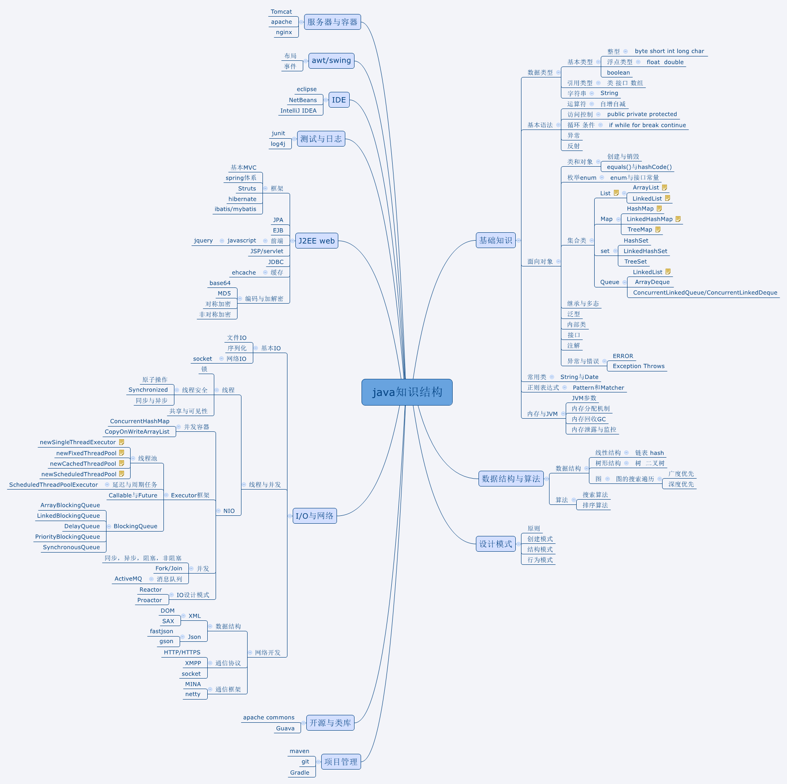
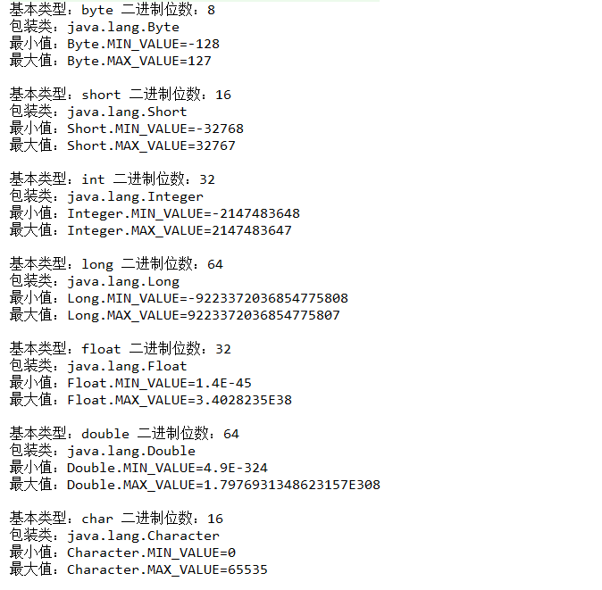
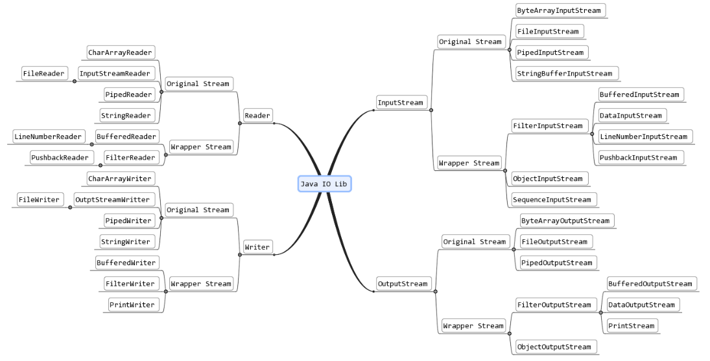
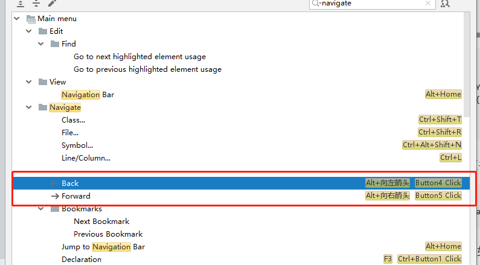

# Test01
java知识点框架



## 练习项目
### 1.八种排序方法
package 位置：[com.example.demo.test01.sort](src/main/java/com/example/demo/test01/sort)

### 2.剑指offer
package 位置：[com.example.demo.test01.offer](src/main/java/com/example/demo/test01/offer)

### 3.练习题
package 位置：[com.example.demo.test01.test](src/main/java/com/example/demo/test01/test)
    
### 4.多线程使用            
package 位置：[com.example.demo.test01.thread](src/main/java/com/example/demo/test01/thread)
    
### 5.Java基本类型            
class 位置：[com.example.demo.test02.PrimitiveTypeTest](src/main/java/com/example/demo/test02/PrimitiveTypeTest.java)

结果图片：  


### 6.反射和类加载机制            
package 位置：[com.example.demo.test02.clazz](src/main/java/com/example/demo/test02/clazz)
 
java类加载图

  

### 7.IO流
package 位置：[com.example.demo.test02.ioStream](src/main/java/com/example/demo/test02/ioStream)

java流结构类图  


### 8.java集合类
package 位置：[com.example.demo.test02.collectionTest](src/main/java/com/example/demo/test02/collectionTest)

### 9.动态规划问题            
package 位置：[com.example.demo.test02.suanfa](src/main/java/com/example/demo/test02/suanfa)


## 其他模版代码
### 1.word转pdf
package 位置：[com.example.demo.test02.word](src/main/java/com/example/demo/test02/word)

### 2.mybatis反向生成代码
package 位置：[com.example.demo.test02.mybatis](src/main/java/com/example/demo/test02/mybatis)

### 3.Redis基本配置
package 位置：[com.example.demo.test02.redis](src/main/java/com/example/demo/test02/redis)

### 4.sql父类子类查询
package 位置：[com.example.demo.test02.sql.getTree.sql](src/main/java/com/example/demo/test02/sql/getTree.sql)


## Idea相关配置
### 1.自动生成文件注释
    File -> Settings -> Editor -> File and Code Templates   
```java
/**
* @Author FLY
* @CreateDate ${YEAR}-${MONTH}-${DAY} ${TIME}
* @ProjectName ${PROJECT_NAME}
* @Desc 
*/
```
### 2.设置编程文字样式
    File -> Settings -> Editor -> Font
    设置样式为“consolas”，字体大小一般为16
    
### 3.Dao接口跳转到实现类(mapper.xml文件)
    1. File -> Settings -> Plugins 
    2. 搜索插件“Free MyBatis plugin”
    3. 或者去官网搜索插件进行下载，然后导入插件
    
### 4.设置idea快捷键
>1. File -> Settings -> Keymap  
>2. 设置键盘风格，一般喜欢用eclipse
>3. ctrl+T是eclipse的风格，直接从方法跳转到接口的实现类    
>4. 搜索“navigate”设置idea回退到上一步快捷键
如图所示
