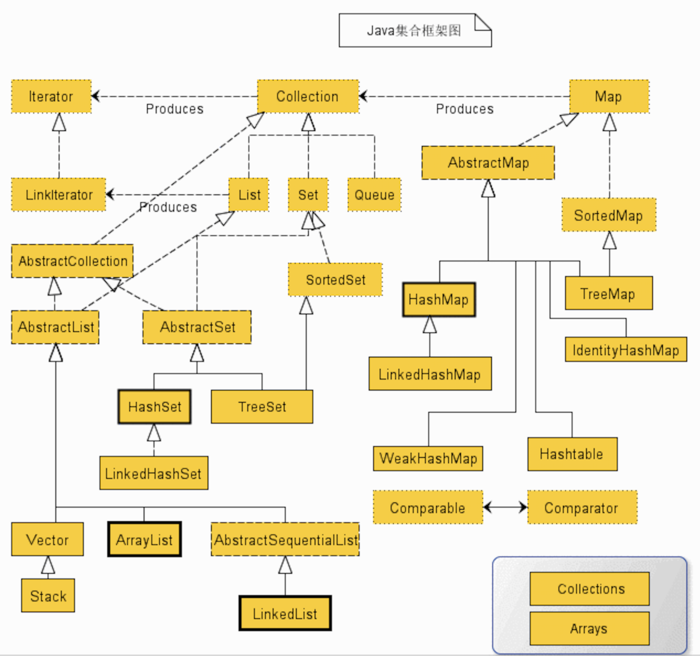
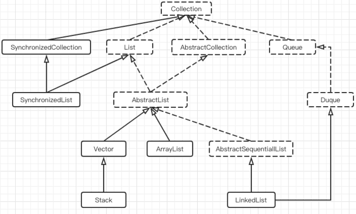

# 集合
[链接](https://blog.csdn.net/a303549861/article/details/93619042)

Java集合框架图

整理后的缩减版，list的相关

- Collection ，为集合层级的根接口。一个集合代表一组对象，这些对象即为它的元素。Java 平台不提供这个接口任何直接的实现。
    - Set ，是一个不能包含重复元素的集合。这个接口对数学集合抽象进行建模，被用来代表集合，就如一副牌。
    - List ，是一个有序集合，可以包含重复元素。你可以通过它的索引来访问任何元素。List 更像长度动态变换的数组。
- Map ，是一个将 key 映射到 value 的对象。一个 Map 不能包含重复的 key，每个 key 最多只能映射一个 value 。
- 一些其它的接口有 Queue、Dequeue、SortedSet、SortedMap 和 ListIterator 。

Java 集合框架提供常用的算法实现，比如排序和搜索。Collections类包含这些方法实现。大部分算法是操作 List 的，但一部分对所有类型的集合都是可用的。部分算法有排序、搜索、混编、最大最小值。

1. List
    - ArrayList ：Object 数组。
    - Vector ：Object 数组。
    - LinkedList ：双向链表(JDK6 之前为循环链表，JDK7 取消了循环)。
2. Map
    - HashMap ：
        - JDK8 之前，HashMap 由数组+链表组成的，数组是HashMap的主体，链表则是主要为了解决哈希冲突而存在的（“拉链法”解决冲突）。
        - JDK8 以后，在解决哈希冲突时有了较大的变化，当链表长度大于阈值（默认为 8 ）时，将链表转化为红黑树，以减少搜索时间。
        - key可以为null
    - LinkedHashMap ：LinkedHashMap 继承自 HashMap，所以它的底层仍然是基于拉链式散列结构即由数组和链表或红黑树组成。另外，LinkedHashMap 在上面结构的基础上，增加了一条双向链表，使得上面的结构可以保持键值对的插入顺序。同时通过对链表进行相应的操作，实现了访问顺序相关逻辑。  
    - Hashtable ：数组+链表组成的，数组是 HashMap 的主体，链表则是主要为了解决哈希冲突而存在的。
        - key不能为null，
    - TreeMap ：红黑树（自平衡的排序二叉树）。
3. Set
    - HashSet ：无序，唯一，基于 HashMap 实现的，底层采用 HashMap 来保存元素。
    - LinkedHashSet ：LinkedHashSet 继承自 HashSet，并且其内部是通过 LinkedHashMap 来实现的。有点类似于我们之前说的LinkedHashMap 其内部是基于 HashMap 实现一样，不过还是有一点点区别的。
    - TreeSet ：有序，唯一，红黑树(自平衡的排序二叉树)。
    
Iterator 接口，提供了很多对集合元素进行迭代的方法。每一个集合类都包含了可以返回迭代器实例的迭代方法。迭代器可以在迭代的过程中删除底层集合的元素，但是不可以直接调用集合的 #remove(Object Obj) 方法删除，可以通过迭代器的 #remove() 方法删除。
-  Iterator 和 ListIterator 的区别是什么？
    - Iterator 可用来遍历 Set 和 List 集合，但是 ListIterator 只能用来遍历 List。
    - Iterator 对集合只能是前向遍历，ListIterator 既可以前向也可以后向。
    - ListIterator 实现了 Iterator 接口，并包含其他的功能。比如：增加元素，替换元素，获取前一个和后一个元素的索引等等。
- 快速失败（fail-fast）和安全失败（fail-safe）的区别是什么？
    - 快速失败：当你在迭代一个集合的时候，如果有另一个线程正在修改你正在访问的那个集合时，就会抛出一个 ConcurrentModification 异常。 在 java.util 包下的都是快速失败。
    - 安全失败：你在迭代的时候会去底层集合做一个拷贝，所以你在修改上层集合的时候是不会受影响的，不会抛出 ConcurrentModification 异常。在 java.util.concurrent 包下的全是安全失败的。
    
- List 和 Set 区别
    - List，Set 都是继承自 Collection 接口。
    - List 特点：元素有放入顺序，元素可重复。
    - List：和数组类似，List 可以动态增长，查找元素效率低，插入删除元素效率，因为可能会引起其他元素位置改变。
    - Set 特点：元素无放入顺序，元素不可重复，重复元素会覆盖掉。
    - Set：检索元素效率高，删除和插入效率低，插入和删除不会引起元素位置改变。
    - 注意：元素虽然无放入顺序，但是元素在 Set 中的位置是有该元素的 hashcode 决定的，其位置其实是固定的。
      另外 List 支持 for 循环，也就是通过下标来遍历，也可以用迭代器，但是 Set 只能用迭代，因为他无序，无法用下标来取得想要的值。
        
- List 和 Map 区别
    - List 是对象集合，允许对象重复。
    - Map 是键值对的集合，不允许 key 重复。
    
- Array 和 ArrayList 有何区别？什么时候更适合用 Array？
    - Array 可以容纳基本类型和对象，而 ArrayList 只能容纳对象。
    - Array 是指定大小的，而 ArrayList 大小是固定的，可自动扩容。
    - Array 没有提供 ArrayList 那么多功能，比如 addAll、removeAll 和 iterator 等。
    
尽管 ArrayList 明显是更好的选择，但也有些时候 Array 比较好用，比如下面的三种情况。
- 1、如果列表的大小已经指定，大部分情况下是存储和遍历它们
- 2、对于遍历基本数据类型，尽管 Collections 使用自动装箱来减轻编码任务，在指定大小的基本类型的列表上工作也会变得很慢。
- 3、如果你要使用多维数组，使用 [][] 比 List 会方便。

ArrayList 与 LinkedList 区别？
- ArrayList
    - 优点：ArrayList 是实现了基于动态数组的数据结构，因为地址连续，一旦数据存储好了，查询操作效率会比较高（在内存里是连着放的）。
    - 缺点：因为地址连续，ArrayList 要移动数据，所以插入和删除操作效率比较低。
- LinkedList
    - 优点：LinkedList 基于链表的数据结构，地址是任意的，所以在开辟内存空间的时候不需要等一个连续的地址。对于新增和删除操作 add 和 remove ，LinedList 比较占优势。LinkedList 适用于要头尾操作或插入指定位置的场景。
    - 缺点：因为 LinkedList 要移动指针，所以查询操作性能比较低。
    
 ArrayList 是如何扩容的？
 - 如果通过无参构造的话，初始数组容量为 0 ，当真正对数组进行添加时，才真正分配容量。每次按照 1.5 倍（位运算）的比率通过 copeOf 的方式扩容。
 - 在 JKD6 中实现是，如果通过无参构造的话，初始数组容量为10，每次通过 copeOf 的方式扩容后容量为原来的 1.5 倍。
        
ArrayList 与 Vector 区别
- 1.Vector 是多线程安全的，线程安全就是说多线程访问同一代码，不会产生不确定的结果，而 ArrayList 不是。这个可以从源码中看出，Vector 类中的方法很多有 synchronized 进行修饰，这样就导致了 Vector 在效率上无法与 ArrayList 相比。
    
        Vector 是一种老的动态数组，是线程同步的，效率很低，一般不赞成使用。
- 2.两个都是采用的线性连续空间存储元素，但是当空间不足的时候，两个类的增加方式是不同。
- 3.Vector 可以设置增长因子，而 ArrayList 不可以。        

HashMap 和 Hashtable 的区别
- Hashtable 继承 Dictionary ，HashMap 继承的是 Java2 出现的 Map 接口。
- 2、HashMap 去掉了 Hashtable 的 contains 方法，但是加上了 containsValue 和 containsKey 方法。
- 3、HashMap 允许空键值，而 Hashtable 不允许。
- 【重点】4、HashTable 是同步的，而 HashMap 是非同步的，效率上比 HashTable 要高。也因此，HashMap 更适合于单线程环境，而 HashTable 适合于多线程环境。
- 5、HashMap 的迭代器（Iterator）是 fail-fast 迭代器，HashTable的 enumerator 迭代器不是 fail-fast 的。
- 6、HashTable 中数组默认大小是 11 ，扩容方法是 old * 2 + 1 ，HashMap 默认大小是 16 ，扩容每次为 2 的指数大小。        
        
一般现在不建议用 HashTable 。主要原因是两点：
- 一是，HashTable 是遗留类，内部实现很多没优化和冗余。
- 二是，即使在多线程环境下，现在也有同步的 ConcurrentHashMap 替代，没有必要因为是多线程而用 Hashtable 。

HashSet 和 HashMap 的区别
- Set 是线性结构，值不能重复。HashSet 是 Set 的 hash 实现，HashSet 中值不能重复是用 HashMap 的 key 来实现的。
- Map 是键值对映射，可以空键空值。HashMap 是 Map 的 hash 实现，key 的唯一性是通过 key 值 hashcode 的唯一来确定，value 值是则是链表结构

       因为不同的 key 值，可能有相同的 hashcode ，所以 value 值需要是链表结构。
       
- 他们的共同点都是 hash 算法实现的唯一性，他们都不能持有基本类型，只能持有对象。

HashSet 和 TreeSet 的区别？
- HashSet 是用一个 hash 表来实现的，因此，它的元素是无序的。添加，删除和 HashSet 包括的方法的持续时间复杂度是 O(1) 。
- TreeSet 是用一个树形结构实现的，因此，它是有序的。添加，删除和 TreeSet 包含的方法的持续时间复杂度是 O(logn) 。

? 如何决定选用 HashMap 还是 TreeMap？
- 对于在 Map 中插入、删除和定位元素这类操作，HashMap 是最好的选择。
- 然而，假如你需要对一个有序的 key 集合进行遍历， TreeMap 是更好的选择。

基于你的 collection 的大小，也许向 HashMap 中添加元素会更快，再将 HashMap 换为 TreeMap 进行有序 key 的遍历。

队列和栈是什么，列出它们的区别

栈和队列两者都被用来预存储数据。
- java.util.Queue 是一个接口，它的实现类在Java并发包中。队列允许先进先出（FIFO）检索元素，但并非总是这样。Deque 接口允许从两端检索元素。
- 栈与队列很相似，但它允许对元素进行后进先出（LIFO）进行检索。
Stack 是一个扩展自 Vector 的类，而 Queue 是一个接口。
  
-------------------------------------------------------
- ArrayList和Vector默认初始化长度都是10

        
