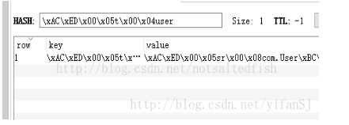

# Redis基本配置  

redis是一个key-value存储系统。  
和Memcached类似，它支持存储的value类型相对更多，
包括string(字符串)、list(链表)、set(集合)、zset(sorted set --有序集合)和hash（哈希类型）。  
这些数据类型都支持push/pop、add/remove及取交集并集和差集及更丰富的操作，而且这些操作都是原子性的。
在此基础上，redis支持各种不同方式的排序。  
与memcached一样，为了保证效率，数据都是缓存在内存中。  
区别的是redis会周期性的把更新的数据写入磁盘或者把修改操作写入追加的记录文件，
并且在此基础上实现了master-slave(主从)同步。
--------------------------------------
### SpringBoot配置Redis
maven引入依赖
```xml
<!--SpringBoot本地连接redis-->
<dependency>
    <groupId>org.springframework.boot</groupId>
    <artifactId>spring-boot-starter-data-redis</artifactId>
</dependency>
```
在SpringBoot中封装Redis操作中有两种：  
RedisTemplate与StringRedisTemplate

1. 两者数据各自存，各自取，数据不互通。
    - RedisTemplate不能取StringRedisTemplate存入的数据。
    - StringRedisTemplate不能取RedisTemplate存入的数据。
2. 序列化策略不同。 SDR默认采用的序列化策略有两种，一种是String的序列化策略，一种是JDK的序列化策略。
    - RedisTemplate采用JDK的序列化策略
    - StringRedisTemplate采用String的序列化策略

RedisTemplate使用的序列类在在操作数据的时候，比如说存入数据会将数据先序列化成字节数组然后在存入Redis数据库，这个时候打开Redis查看的时候，你会看到你的数据不是以可读的形式展现的，而是以字节数组显示，类似下面


当然从Redis获取数据的时候也会默认将数据当做字节数组转化，这样就会导致一个问题，当需要获取的数据不是以字节数组存在redis当中而是正常的可读的字符串的时候，比如说下面这种形式的数据
  
- 注：使用的软件是RedisDesktopManager


RedisTemplate就无法获取导数据，这个时候获取到的值就是NULL。这个时候StringRedisTempate就派上了用场。  

当Redis当中的数据值是以可读的形式显示出来的时候，只能使用StringRedisTemplate才能获取到里面的数据。  
所以当你使用RedisTemplate获取不到数据的时候请检查一下是不是Redis里面的数据是可读形式而非字节数组

- 总结：
  
  当你的redis数据库里面本来存的是字符串数据或者你要存取的数据就是字符串类型数据的时候，那么你就使用StringRedisTemplate即可，但是如果你的数据是复杂的对象类型，而取出的时候又不想做任何的数据转换，直接从Redis里面取出一个对象，那么使用RedisTemplate是更好的选择。

java具体引用代码：
模板如[RedisTest01](RedisTest01.java)


----------------------------
### Jedis配置
上面是SpringBoot调用redis，下面要讲的是java调用redis，使用jedis的jar包
maven导入依赖
```xml
<!--java本地连接redis-->
<dependency>
    <groupId>redis.clients</groupId>
    <artifactId>jedis</artifactId>
    <version>3.2.0</version>
</dependency>
```
Jedis是Redis官方推荐的面向Java的操作Redis的客户端，而RedisTemplate是SpringDataRedis中对JedisApi的高度封装。

jedis连接redis
```java
//连接本地的 Redis 服务
Jedis jedis = new Jedis("localhost");
System.out.println("连接成功");
System.out.println(jedis.ping());
```
模板如[RedisTest02](RedisTest02.java)

Jedis 是 Redis 的 java 版本客户端，使用Jedis可以连接 Redis的数据库，Jedis连接方式有三种Jedis/JedisPool 连接、ShardedJedis/ShardedJedisPool 连接、JedisCluster 连接。


设计redis连接池连接
```java
//获得池子对象
JedisPoolConfig poolconfig = new JedisPoolConfig();
poolconfig.setMaxIdle(Integer.parseInt(pro.get("redis.maxIdle").toString()));//最大闲置个数
poolconfig.setMinIdle(Integer.parseInt(pro.get("redis.minIdle").toString()));//最小闲置个数
poolconfig.setMaxTotal(Integer.parseInt(pro.get("redis.maxTotal").toString()));//最大连接数
pool = new JedisPool(poolconfig,pro.getProperty("redis.url"), Integer.parseInt(pro.get("redis.port").toString()));
```
模板如[JedisPoolUtils](JedisPoolUtils.java) 和 [RedisTest03](RedisTest03.java)

--------------------------------------------------------------
### Redis命令
[Redis的基础知识](https://www.cnblogs.com/xinhuaxuan/p/9171275.html)

##### string
> String：字符串，可以存在String、Integer、Float型的数据，甚至是二进制数据，一个字符串最大容量是512M


##### list
> List: 字符串List,底层实现上不是数组，而是链表，也就是说头部和尾部插入一个新元素，其时间复杂度是常数级别的；其弊端是：元素的定位比数组慢。


##### hash
> Hash: 按Hash方式来存放字符串


##### set
> Set: 字符串Set，无序不可重复，是通过HashTable实现的


##### zset
> ZSet: 字符串set，有序且不可重复，根据Score来排序。底层使用散列表和跳跃表来实现，所以读取中间部分的数据也很快

